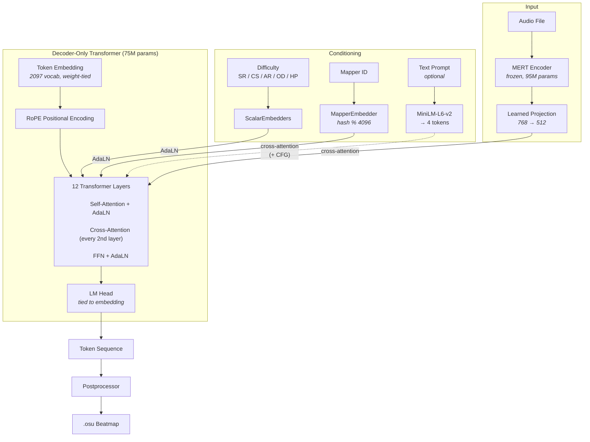

# ai-osu-maps

Autoregressive transformer for generating [osu!](https://osu.ppy.sh) beatmaps from audio.

Given an audio file and difficulty parameters, the model generates a complete beatmap — circles, sliders, timing, and structure — as a sequence of tokens.

## Architecture



### Components

- **AudioEncoder**: Frozen [MERT](https://huggingface.co/m-a-p/MERT-v1-95M) with learned layer weights and a trained linear projection. Outputs audio features at ~75Hz.
- **Transformer**: 512 d_model, 8 heads, 12 layers, 2048 max_seq_len. Cross-attention to audio every 2nd layer. AdaLN conditioning from difficulty scalars and mapper identity. RoPE positional encoding. Weight-tied embedding/lm_head.
- **Tokenizer**: 2097-token vocabulary encoding TIME_SHIFT, SNAPPING, DISTANCE, POS, CIRCLE, SLIDER_HEAD, anchors, BEAT, MEASURE, TIMING_POINT, and more.
- **Text conditioning** (optional): sentence-transformers `all-MiniLM-L6-v2` projected to 4 cross-attention tokens, with classifier-free guidance at inference.

## Setup

```bash
pip install -r requirements.txt
```

### Slider fork

This project depends on a [fork of slider](https://github.com/cmyui/slider) (an osu! file parser) pinned to a specific commit. The fork includes fixes for encoding edge cases, numeric overflow in certain beatmaps, and other parsing issues not yet upstreamed. The pin in `requirements.txt` installs it directly from GitHub.

## Dataset preparation

### Beatmapset ID list

The download pipeline needs a list of beatmapset IDs as a TSV file with `beatmapset_id` in the first column (additional columns are ignored):

```tsv
1073074
1495669
765778
```

A sample `top_beatmapsets.tsv` is included in the repo, containing the most popular beatmapsets from [Akatsuki](https://akatsuki.gg)'s vanilla osu! leaderboards. You can use it directly or supply your own list sourced from the [osu! API](https://osu.ppy.sh/docs/index.html) or community databases.

### Generate dataset (unified)

```bash
python generate_dataset.py \
  --dataset_dir dataset \
  --set_ids_file top_beatmapsets.tsv \
  --limit 10000 \
  --device cuda
```

This runs all three preparation stages sequentially:

1. **Download** — fetches .osz archives from mirror sites, extracts audio + .osu files
2. **Precompute audio** — runs MERT on each song's audio, saves `audio_features.pt` per directory
3. **Precompute tokens** — parses .osu files into tokenized beatmaps, saves `beatmap_tokens.pt` per directory

Each stage is idempotent (completed work is skipped), so re-running is safe.

Options:
| Flag | Description |
|------|-------------|
| `--set_ids_file` | TSV with beatmapset_id in first column |
| `--device` | Torch device for audio encoding (default: cuda if available) |
| `--force` | Recompute cached audio features and tokens |
| `--dry_run` | List downloads without fetching |
| `--limit` | Max beatmap sets to process (default: 100) |
| `--chunk_size` | Download batch size (default: 200) |

Individual stages can also be run standalone:

```bash
python -m dataset_pipeline.download --dataset_dir dataset --set_ids_file top_beatmapsets.tsv --limit 10000

# Single GPU
python -m dataset_pipeline.precompute_audio --dataset_dir dataset --device cuda

# Multi-GPU (via torchrun)
torchrun --nproc_per_node=2 -m dataset_pipeline.precompute_audio --dataset_dir dataset

python -m dataset_pipeline.precompute_tokens --dataset_dir dataset
```

## Training

```bash
# Single GPU
python train.py \
  --dataset_dir dataset \
  --device cuda \
  --batch_size 8 \
  --max_epochs 500

# Multi-GPU (DDP via torchrun)
torchrun --nproc_per_node=2 train.py \
  --dataset_dir dataset \
  --batch_size 16 \
  --max_epochs 500
```

Key features:

- Multi-GPU via `torchrun` (DDP with NCCL backend)
- Teacher forcing with weighted cross-entropy (rhythm 3x, objects 2x, position 1.5x)
- Auxiliary object count predictor head (log-space L1 loss)
- Cosine warmup LR schedule, AdamW, gradient accumulation (4 steps)
- EMA weights (0.9999 decay)
- Checkpoints saved every epoch to `checkpoints/`

| Flag                   | Description                                                                        |
| ---------------------- | ---------------------------------------------------------------------------------- |
| `--window_sec N`       | Train on random N-second windows (requires re-running `precompute_tokens --force`) |
| `--max_maps N`         | Limit song directories (useful for quick experiments)                              |
| `--resume PATH`        | Resume from a checkpoint                                                           |
| `--wandb_project NAME` | Enable wandb logging                                                               |

## Inference

```bash
python inference.py \
  --audio_path song.mp3 \
  --checkpoint checkpoints/checkpoint_epoch_0149.pt \
  --difficulty 5.5 \
  --cs 4.0 --ar 9.3 --od 8.5 --hp 6.0 \
  --bpm 174.0 \
  --temperature 0.9 --timing_temperature 0.1 --top_p 0.95 \
  --max_tokens 8192 \
  --osz \
  --device cuda
```

| Flag                   | Description                                                             |
| ---------------------- | ----------------------------------------------------------------------- |
| `--osz`                | Bundle output as .osz (includes audio file)                             |
| `--stream`             | Print tokens to stderr as they're generated                             |
| `--prompt "text"`      | Optional text conditioning for style                                    |
| `--cfg_scale 2.0`      | Classifier-free guidance scale (with text prompt)                       |
| `--temperature`        | Sampling temperature for most tokens                                    |
| `--timing_temperature` | Near-greedy temperature for timing tokens (BEAT, MEASURE, TIMING_POINT) |
| `--no_monotonic_time`  | Allow backward time jumps (disabled by default)                         |
| `--mapper N`           | Mapper ID for style conditioning (0 = unknown)                          |
| `--no_ema`             | Use trained weights instead of EMA                                      |

## Audio encoder state consistency

The AudioEncoder's projection layer is randomly initialized. The same weights must be used across precomputation, training, and inference:

1. `precompute_audio.py` saves `audio_encoder.pt` in the dataset directory on first run
2. `train.py` loads it from the dataset dir and embeds it in training checkpoints
3. `inference.py` loads the encoder state from the checkpoint

If features were precomputed with different encoder weights, inference will produce degenerate output. When changing encoder weights, recompute all features with `--force`.

## Project structure

```
generate_dataset.py                      # Unified dataset pipeline orchestrator
dataset_pipeline/
  download.py                            # Parallel multi-mirror .osz downloading
  precompute_audio.py                    # MERT audio feature caching
  precompute_tokens.py                   # Beatmap tokenization caching
train.py                                 # Training entry point
inference.py                             # Inference entry point
ai_osu_maps/
  config.py                              # ModelConfig, TrainingConfig, GenerationConfig
  model/
    transformer.py                       # Decoder-only transformer
    audio_encoder.py                     # MERT-based audio encoder
    conditioning.py                      # ScalarEmbedder, MapperEmbedder for AdaLN
    text_encoder.py                      # Optional MiniLM text encoder
  data/
    tokenizer.py                         # 2097-vocab tokenizer
    event.py                             # EventType enum, Event dataclass
    osu_parser.py                        # Beatmap <-> events <-> tokens
    dataset.py                           # PyTorch Dataset + collate
  inference/
    sampler.py                           # Autoregressive sampling loop
    postprocessor.py                     # Events -> .osu file + .osz bundling
```

## License

[MIT](LICENSE)
